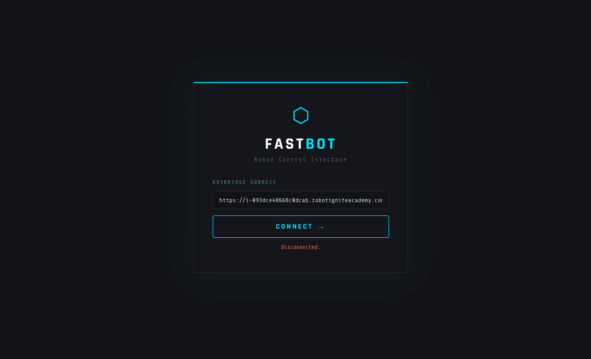
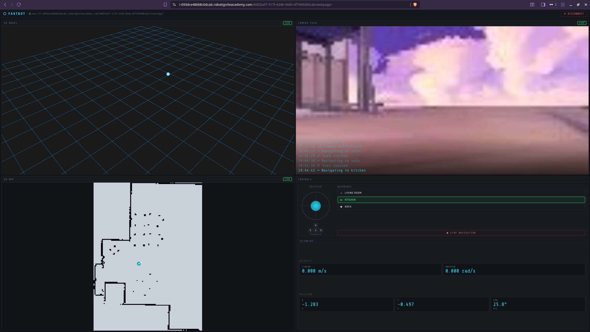

# Fastbot Web-Based Control

Frontend for the Fastbot robot — Vite + TypeScript SPA that connects to a ROS bridge and exposes a 3D model viewer, 2D occupancy map, MJPEG camera feed and teleop controls.

## Screenshots
### Landing page (rosbridge connection)
<p align="center"></p>

### Navigation page
<p align="center"></p>

## Project structure
```
fastbot_webapp/
├── index.html              # Vite entry HTML
├── package.json
├── tsconfig.json
├── vite.config.ts
├── public/
│   ├── fastbot_description/  # URDF + meshes (served verbatim)
│   ├── images/
│   └── vendor/               # Vendored UMD libs (ros3d, mesh loaders)
└── src/
    ├── main.ts               # App entry — wires DOM + module lifecycle
    ├── styles/style.css
    ├── ros/
    │   ├── connection.ts     # rosbridge connect/disconnect + listeners
    │   ├── logger.ts         # On-screen log overlay
    │   └── types.ts          # ROS message shape declarations
    ├── modules/
    │   ├── camera.ts         # MJPEG  stream
    │   ├── joystick.ts       # Canvas joystick + WASD teleop
    │   ├── map2d.ts          # 2D occupancy grid renderer
    │   ├── model3d.ts        # ros3djs URDF + map + laser
    │   ├── navigation.ts     # Nav2 waypoint goals
    │   └── telemetry.ts      # Pose + velocity readout
    ├── types/globals.d.ts    # Ambient declarations for vendored UMD globals
    └── utils/load-script.ts  # Promise-wrapped <script> injector
```

## Development

```bash
cd fastbot_webapp
pnpm install
pnpm dev          # Vite dev server on http://localhost:7000
```

Other scripts:

| Script | Purpose |
| --- | --- |
| `pnpm build` | Type-check + production build to `dist/` |
| `pnpm preview` | Serve the production build locally |
| `pnpm typecheck` | `tsc --noEmit` only |
| `pnpm lint` | ESLint over `src/` |
| `pnpm format` | Prettier write |

## Running the full stack

Launch the part-1 stack first:

```bash
ros2 launch fastbot_slam navigation.launch.py
```

Then in separate terminals:

```bash
# 1. Frontend dev server (or `pnpm preview` after build)
cd ~/webpage_ws/fastbot_webapp
pnpm dev

# 2. ROS bridge
ros2 launch rosbridge_server rosbridge_websocket_launch.xml

# 3. Camera streaming
ros2 run web_video_server web_video_server --ros-args -p port:=11315

# 4. TF web republisher (used by the 3D viewer)
ros2 run tf2_web_republisher_py tf2_web_republisher
```

Get the public addresses with:

```bash
webpage_address
rosbridge_address
```

> ℹ️ You can paste the same webpage address under the rosbridge address placeholder — the connect screen converts it to the `wss://.../rosbridge/` form automatically.

## Notes

- `roslib` and `three` are pulled from npm with proper types.
- `ros3djs`, `ColladaLoader`, `STLLoader` ship as legacy UMD scripts — they are vendored under `public/vendor/` and loaded at runtime via [`src/utils/load-script.ts`](src/utils/load-script.ts) after `window.THREE` and `window.ROSLIB` are set in [`src/main.ts`](src/main.ts).
- The MJPEG camera feed uses a plain `` tag (browsers natively render `multipart/x-mixed-replace`), removing the old `mjpegcanvas` dependency.
